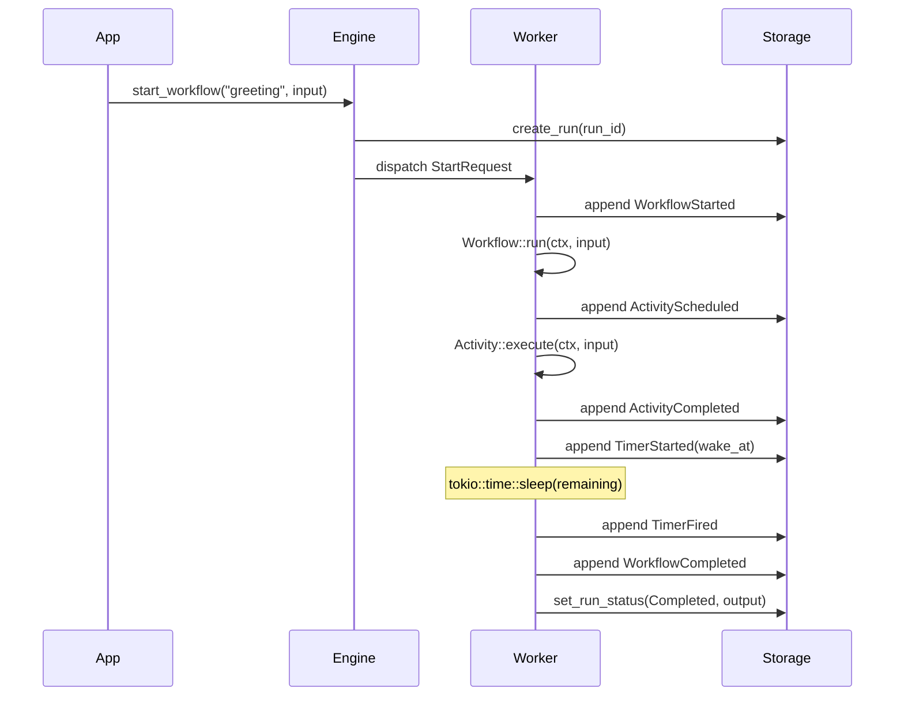
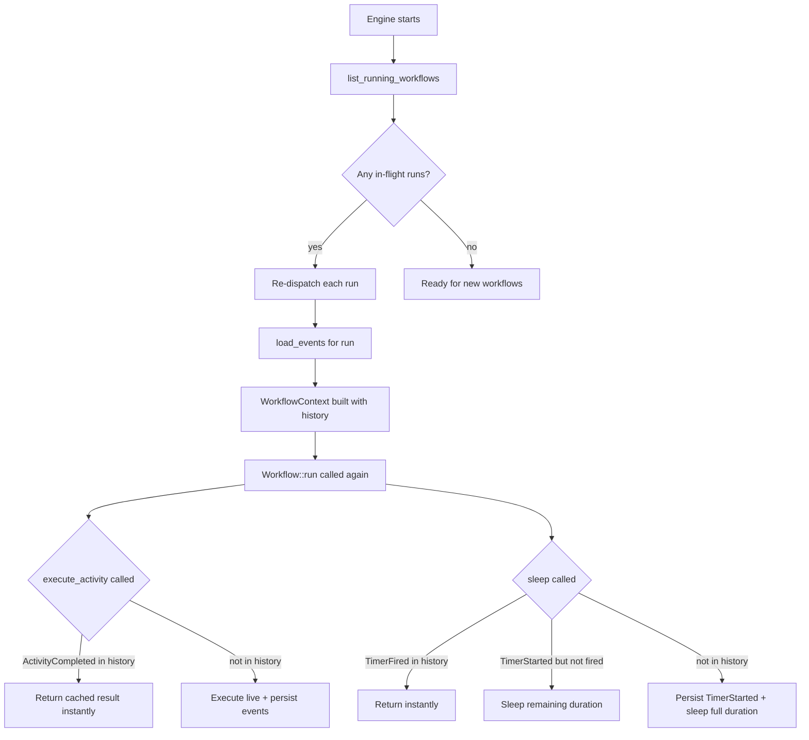
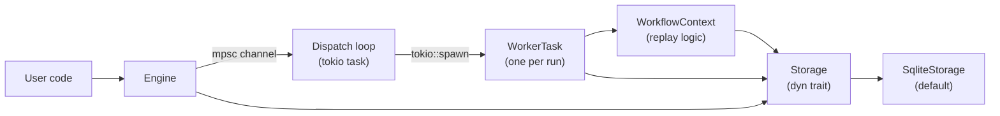

# ZDFlow

A durable workflow execution engine written in Rust, inspired by [Temporal.io](https://temporal.io). zdflow lets you write long-running, stateful business processes as ordinary async Rust functions — crash the process mid-execution, restart it, and the workflow resumes exactly where it left off.

## How it works

ZDFlow persists every state transition to an append-only event log (SQLite). When a workflow is re-executed after a crash, the engine **replays** those events to fast-forward to the point where execution stopped, then continues from there.



On crash-recovery, the engine calls `list_running_workflows()` at startup and re-dispatches those runs. The `WorkflowContext` loads the saved event history and skips already-completed steps:



## Mental model

Think of a workflow as a **recipe that remembers its own progress**. Each step — calling an external API, sending an email, waiting — is recorded in an append-only log before and after it runs. If the process crashes mid-recipe and restarts, the engine reads the log and knows exactly which steps finished, so it skips them and continues from where it left off.

This is what "durable execution" means: the workflow function contains the business logic, and the event log is the source of truth about how far it got.

Three rules follow from this model:

1. **Workflow code must be deterministic.** The engine re-executes the function from the top on recovery, using the event log to supply results for already-completed steps. If the function makes different calls in a different order on the second run, the replay breaks. See [Determinism rules](#determinism-rules) for details.

2. **All I/O belongs in activities.** Anything that can fail or has side effects (HTTP calls, database writes, sending email) must go through `ctx.execute_activity()`. Activity results are persisted, so they survive a crash and are returned from cache on replay.

3. **Timers are durable.** `ctx.sleep()` stores the absolute wake time in the event log. On recovery, only the remaining duration is slept — the original full duration is not restarted.

## Core concepts

### Workflow

A `Workflow` is a deterministic async function. It must not perform I/O directly — all side effects go through `ctx.execute_activity()` or `ctx.sleep()`. The engine may re-execute the function multiple times during replay; the function must produce the same sequence of calls each time.

```rust
struct MyWorkflow;

impl Workflow for MyWorkflow {
    fn name(&self) -> &'static str { "my_workflow" }

    fn run(&self, ctx: WorkflowContext, input: Value) -> WorkflowFuture {
        Box::pin(async move {
            let result = ctx.execute_activity("my_activity", input).await?;
            ctx.sleep(Duration::from_secs(60)).await?;
            Ok(result)
        })
    }
}
```

### Activity

An `Activity` performs the actual I/O — HTTP calls, database writes, sending emails. Activities are retried automatically on failure with exponential backoff. Activities are referenced by name (the string returned by `Activity::name()`), not by passing an instance.

```rust
struct MyActivity;

impl Activity for MyActivity {
    fn name(&self) -> &'static str { "my_activity" }

    fn execute(&self, ctx: ActivityContext, input: Value) -> ActivityFuture {
        Box::pin(async move {
            // Any I/O is safe here
            Ok(json!({ "done": true }))
        })
    }

    fn max_attempts(&self) -> u32 { 5 }
    fn retry_base_delay(&self) -> Duration { Duration::from_secs(2) }
    fn timeout(&self) -> Option<Duration> { Some(Duration::from_secs(30)) }
}
```

Retry timing: delay before attempt `n` = `base_delay × 2^(n-1)`.

### Activity timeouts

Activities can define an optional `timeout()`. If an activity does not complete within the timeout duration, the attempt is treated as a failure and may be retried (up to `max_attempts`). Each timed-out attempt persists an `ActivityAttemptTimedOut` event.

```rust
fn timeout(&self) -> Option<Duration> {
    Some(Duration::from_secs(30))  // 30s per attempt
}
```

### Durable timers

`ctx.sleep(duration)` and `ctx.sleep_until(datetime)` are crash-safe. The absolute wake time is stored in the event log when the timer is first created. After a crash, only the **remaining** duration is slept — not the full original duration.

### Parallel activities

`ctx.execute_activities_parallel()` executes multiple activities concurrently while preserving deterministic replay. Sequence IDs are pre-allocated for all branches, so replay correctness is maintained.

```rust
let results = ctx.execute_activities_parallel(vec![
    ("fetch_user", json!({"id": 1})),
    ("fetch_user", json!({"id": 2})),
    ("fetch_orders", json!({"user_id": 1})),
]).await?;
// results[0], results[1], results[2] correspond to the inputs in order
```

If any activity fails, remaining in-flight activities are cancelled and the first error is returned.

### Versioning

`ctx.get_version()` enables safe workflow code changes while runs are in-flight. On a fresh execution, `max_version` is stored and returned. On replay, the previously stored version is returned. This lets you branch on code versions without breaking in-progress runs.

```rust
fn run(&self, ctx: WorkflowContext, input: Value) -> WorkflowFuture {
    Box::pin(async move {
        let version = ctx.get_version("add_notification", 1, 2).await?;

        let result = ctx.execute_activity("process_order", input).await?;

        if version >= 2 {
            // New code path — only runs for new executions.
            ctx.execute_activity("send_notification", result.clone()).await?;
        }

        Ok(result)
    })
}
```

Unlike `execute_activity` and `sleep`, version markers are keyed by `change_id` (not by sequence position), so inserting a `get_version` call does not shift other calls' sequence IDs.

### Workflow cancellation

Running workflows can be cancelled via `engine.cancel_workflow(run_id)`. At the next yield point (`execute_activity` or `sleep`), the context returns `ZdflowError::Cancelled`, a `WorkflowCancelled` event is written, and the run status is set to `Cancelled`.

```rust
engine.cancel_workflow(run_id).await?;
```

Workflows can also check `ctx.is_cancelled()` for cooperative cancellation within long-running logic.

### Scheduled workflows

`engine.schedule_workflow()` fires a workflow on a cron schedule. Schedules are persisted in SQLite and automatically re-registered on engine restart.

```rust
// Register a schedule — fires every day at 08:00 on weekdays.
engine
    .schedule_workflow(
        "daily-report",          // stable name (primary key)
        "0 0 8 * * Mon-Fri",     // 6-field cron: sec min hour dom month dow
        "generate_report",       // registered workflow name
        json!({"type": "daily"}),
    )
    .await?;

// List all schedules
let schedules = engine.list_schedules().await?;
for s in &schedules {
    println!("{} — {:?} — last fired: {:?}", s.name, s.status, s.last_fired_at);
}

// Pause (no missed fires are replayed on resume)
engine.pause_schedule("daily-report").await?;

// Resume (fires at the next future cron slot)
engine.resume_schedule("daily-report").await?;

// Permanently delete
engine.delete_schedule("daily-report").await?;
```

**Cron expression format** — 6-field standard: `sec min hour dom month dow`

| Field | Values |
|---|---|
| sec | 0–59 or `*/N` |
| min | 0–59 or `*/N` |
| hour | 0–23 or `*/N` |
| dom | 1–31, `*` |
| month | 1–12, `Jan`–`Dec`, `*` |
| dow | 0–7 (0=Sun), `Sun`–`Sat`, `*` |

Examples:
- `"*/30 * * * * *"` — every 30 seconds
- `"0 0 9 * * Mon-Fri"` — weekdays at 09:00
- `"0 0 0 1 * *"` — first of every month at midnight

**Behaviour notes:**
- Calling `schedule_workflow` with an existing name replaces the schedule (new cron expression takes effect immediately).
- Paused schedules skip missed fires. On `resume_schedule`, the next future cron slot is used.
- Overlapping runs are allowed by default: if a workflow run is still in-progress when the next tick fires, a new run is started in parallel.

### Run listing and search

`engine.list_runs()` returns workflow runs matching a filter:

```rust
let completed = engine.list_runs(&RunFilter {
    status: Some(RunStatus::Completed),
    workflow_name: Some("my_workflow".into()),
    limit: Some(10),
    ..Default::default()
}).await?;

for run in &completed {
    println!("{} — {:?} — {}", run.run_id, run.status, run.workflow_name);
}
```

`RunFilter` supports: `status`, `workflow_name`, `created_after`, `created_before`, `limit`, `offset`.

## Determinism rules

The workflow function will be executed **more than once**: on crash recovery, the engine re-runs it from the top, fast-forwarding through history. Each call to `execute_activity` or `sleep` is matched to history by its call position (a `sequence_id` counter that starts at 0 and increments with each call). If the function's call sequence differs between runs, the engine reads the wrong history entries and replay produces incorrect results.

### What the engine requires

The function must produce the **exact same sequence of `ctx` calls** every time it runs, given the same history. The actual data returned by those calls may vary (it is replayed from the log), but the number and order of calls must be fixed.

### Do not do this inside a workflow function

```rust
// ❌ System time — different value on every execution
let now = SystemTime::now();

// ❌ Random values — different on every execution
let id = rand::random::<u64>();

// ❌ Direct I/O — will re-execute on replay, causing duplicate side effects
let resp = reqwest::get("https://api.example.com/data").await?;

// ❌ Environment variables or config that might change between runs
let flag = std::env::var("FEATURE_FLAG").unwrap_or_default();

// ❌ Spawning tasks or threads — not tracked by the replay mechanism
tokio::spawn(async { /* ... */ });
```

### Wrap all non-determinism in activities instead

```rust
// ✅ Any I/O or non-determinism goes through execute_activity
let data = ctx.execute_activity("fetch_data", json!({"url": "..."})).await?;

// ✅ If you need the current time, fetch it as an activity so it's recorded
let now_str = ctx.execute_activity("get_current_time", json!({})).await?;
```

### Branching on activity results is safe

Branching on a result from `execute_activity` is fine — the result comes from the replay cache, so the same branch is taken on every replay:

```rust
let status = ctx.execute_activity("check_status", input).await?;
if status["state"] == "pending" {
    // Safe — this branch is always taken on replay because the cached result is "pending"
    ctx.sleep(Duration::from_secs(60)).await?;
}
```

### Adding or removing calls requires versioning

If you deploy new code that inserts an `execute_activity` call before existing calls, every subsequent call shifts its `sequence_id` by one. In-flight workflows will then read the wrong history entries on replay. Use `ctx.get_version()` to gate new calls so existing runs follow the old path and new runs follow the new path. See [Versioning](#versioning) above.

## Event log

Every state transition appends an immutable event. The full schema:

| Event | When written |
|---|---|
| `WorkflowStarted` | Once, when a new run begins |
| `ActivityScheduled` | Before each activity execution |
| `ActivityCompleted` | Activity returned `Ok` |
| `ActivityAttemptFailed` | One attempt failed; retries remain |
| `ActivityAttemptTimedOut` | One attempt timed out; retries remain |
| `ActivityErrored` | All retries exhausted |
| `TimerStarted` | When `ctx.sleep*` is first called |
| `TimerFired` | After the sleep elapses |
| `VersionMarker` | When `ctx.get_version()` records a version |
| `WorkflowCompleted` | Workflow returned `Ok` |
| `WorkflowFailed` | Workflow returned `Err` |
| `WorkflowCancelled` | Workflow was cancelled |

Each event carries a monotonic `sequence` (global position in the run's log) and a `sequence_id` (logical call index, shared between activities and timers, used as the replay key).

## Sequence IDs and the replay key

Every call to `execute_activity` or `sleep` in a workflow is assigned a `sequence_id` from a counter that starts at 0 and increments with each call. This counter is the replay key: on recovery, the engine re-executes the function from the top, rebuilding the same counter, and each call looks up its result in history by `sequence_id`.

```
Call 0: execute_activity("send_email", ...)    → looks for ActivityCompleted { sequence_id: 0 }
Call 1: sleep(60s)                              → looks for TimerFired        { sequence_id: 1 }
Call 2: execute_activity("log_result", ...)    → looks for ActivityCompleted { sequence_id: 2 }
```

If all three events are in history, all three calls return instantly from cache and execution continues live from call 3 onwards.

This is also why `sequence_id` is distinct from `sequence`: `sequence` is the global position of the event in the log (used for ordering), while `sequence_id` is the logical call index used as the lookup key during replay. Multiple events can share the same `sequence_id` — for example, `ActivityScheduled`, `ActivityAttemptFailed`, and `ActivityCompleted` all carry `sequence_id: 0` for the first activity call.

### Parallel activities and ID pre-allocation

`execute_activities_parallel` atomically pre-allocates `n` sequence IDs (one per branch) before spawning any tasks. This ensures that even though branches run concurrently, each has a deterministic, stable ID for replay regardless of which branch completes first.

```
execute_activities_parallel([("fetch_user", ...), ("fetch_orders", ...)])
  → atomically increments counter by 2, allocating sequence_id 4 and 5
  → spawns two concurrent tasks, each using its pre-allocated ID
  → on replay: each branch independently replays from its own stable ID
```

### Version markers do not consume sequence IDs

`get_version` is keyed by its `change_id` string, not by sequence position. This means inserting a `get_version` call anywhere in the workflow does not shift the sequence IDs of any surrounding `execute_activity` or `sleep` calls, making it safe to add version checks to workflows that have in-flight runs.

## Getting started

```bash
# Run the demo HTTP server
cargo run

# In another terminal
curl -X POST http://localhost:3000/greet \
     -H 'Content-Type: application/json' \
     -d '{"name": "Alice"}'
# Returns: {"run_id": "<uuid>"}
```

The demo runs a `GreetingWorkflow` that executes an activity, sleeps 2 seconds, then executes the activity again. Kill the process during the sleep, restart it, and the workflow resumes with only the remaining time left.

## Engine setup

```rust
let storage = SqliteStorage::open("my-app.db").await?;

let mut engine = WorkflowEngine::builder()
    .with_storage(storage)
    .register_workflow(MyWorkflow)
    .register_activity(MyActivity)
    .max_concurrent_workflows(100)  // default: 100
    .build()
    .await?;

let handle = engine.run().await?;   // starts dispatch loop + crash recovery
let engine = Arc::new(engine);

// Start a workflow
let run_id = engine.start_workflow("my_workflow", json!({"key": "value"})).await?;

// Poll status
let status = engine.get_run_status(run_id).await?;

// List runs
let runs = engine.list_runs(&RunFilter::default()).await?;

// Cancel a workflow
engine.cancel_workflow(run_id).await?;

// Graceful shutdown
handle.shutdown().await;
```

## Workflow run lifecycle

Here is the exact sequence of operations for a single workflow run, from submission to completion.

### 1. Submitting a run

`engine.start_workflow("name", input)` does the following synchronously before returning:

1. Validates that the workflow name is registered (returns `WorkflowNotFound` otherwise).
2. Generates a new UUID `run_id`.
3. Calls `storage.create_run(run_id, name, input)` — the run record is written to the database with status `Running`. **The run exists in the database at this point, even before any execution begins.**
4. Sends a `StartRequest` over an internal `mpsc::channel(1024)` to the dispatch loop.
5. Returns `run_id` to the caller immediately. The workflow has not started executing yet.

### 2. Dispatch loop

The dispatch loop runs as a background Tokio task started by `engine.run()`. For each `StartRequest`:

1. Loads the full event history from storage (`load_events(run_id)`). For a brand-new run this is empty. For a recovered run this contains all previously persisted events.
2. Acquires a permit from the concurrency semaphore. If `max_concurrent_workflows` permits are exhausted, this step blocks until a running workflow completes.
3. Spawns a new Tokio task (`WorkerTask`) to execute the workflow. The semaphore permit is owned by the spawned task and dropped automatically when it finishes, freeing the slot.

### 3. WorkerTask execution

1. **New runs only**: if no `WorkflowStarted` event is in history, writes `WorkflowStarted { workflow_name, input }` to the log.
2. Builds a `WorkflowContext` from the history, storage reference, and activity registry.
3. Registers the context in a shared cancel-handle map keyed by `run_id`. This is what allows `engine.cancel_workflow(run_id)` to reach the live context.
4. Calls `workflow.run(ctx, input)` and awaits the result.

### 4. Inside WorkflowContext (per call)

**`ctx.execute_activity("name", input)`**:
- Atomically increments the call counter → `sequence_id`.
- Scans history for `ActivityCompleted { sequence_id }` or `ActivityErrored { sequence_id }`.
  - **Found in history (replay)**: returns the cached output or error immediately. No I/O occurs.
  - **Not in history (live)**: persists `ActivityScheduled`, then runs the retry loop. Each failed attempt persists `ActivityAttemptFailed` or `ActivityAttemptTimedOut`. On success persists `ActivityCompleted`; on exhaustion persists `ActivityErrored`.

**`ctx.sleep(duration)` / `ctx.sleep_until(wake_at)`**:
- Atomically increments the call counter → `sequence_id`.
- If `TimerFired { sequence_id }` is in history: returns immediately (full replay).
- If `TimerStarted { sequence_id, wake_at }` is in history but not `TimerFired`: uses the **originally persisted** `wake_at` (not the value computed from the current `duration`), so the remaining duration is correct even if more time passed during the crash.
- If neither: persists `TimerStarted { wake_at }`, sleeps the full duration, then persists `TimerFired`.

### 5. Cancellation

When `engine.cancel_workflow(run_id)` is called, it sets an atomic flag on the context and fires a `tokio::sync::Notify`. The workflow's next `execute_activity` or `sleep` call will see the flag and return `ZdflowError::Cancelled`. If the workflow is mid-activity, the `tokio::select!` inside the activity execution wakes on the notification and returns `Cancelled` immediately — the activity is interrupted rather than completing.

### 6. WorkerTask completion

After `workflow.run` returns, the terminal event is written and the run status is updated:

| Result | Terminal event written | Final status |
|---|---|---|
| `Ok(output)` | `WorkflowCompleted { output }` | `Completed` |
| `Err(ZdflowError::Cancelled)` | `WorkflowCancelled { reason }` | `Cancelled` |
| `Err(other)` | `WorkflowFailed { error }` | `Failed` |

The context is removed from the cancel-handle map and the semaphore permit is released.

### What happens on process crash

If the process dies at any point, the run's status remains `Running` in the database. On the next `engine.run()` call, `list_running_workflows()` finds all `Running` runs and re-dispatches them as `StartRequest`s. Each run replays through its history up to the last persisted event and then continues executing live.

## Metrics

zdflow optionally records metrics via the [`metrics`](https://docs.rs/metrics) facade. Enable the `metrics` Cargo feature and install your own exporter (e.g. `metrics-exporter-prometheus`).

```toml
[dependencies]
zdflow = { version = "0.1", features = ["metrics"] }
metrics-exporter-prometheus = "0.16"
```

Emitted metrics:

| Metric | Type | Description |
|---|---|---|
| `zdflow_workflow_started_total` | counter | Workflows started (label: `workflow`) |
| `zdflow_workflow_completed_total` | counter | Workflows completed successfully |
| `zdflow_workflow_failed_total` | counter | Workflows that failed |
| `zdflow_workflow_cancelled_total` | counter | Workflows cancelled |
| `zdflow_workflow_active` | gauge | Currently in-progress workflows |
| `zdflow_activity_started_total` | counter | Activity executions started (label: `activity`) |
| `zdflow_activity_completed_total` | counter | Activity executions completed |
| `zdflow_activity_retries_total` | counter | Activity retry attempts |
| `zdflow_activity_duration_seconds` | histogram | Activity execution duration |

## Error handling

`ZdflowError` variants and when you will encounter them:

| Variant | When it occurs | What to do |
|---|---|---|
| `ActivityFailed(msg)` | Activity exhausted all retry attempts. The message is from the last attempt. | Propagates as `Err(...)` to the workflow; handle or let the workflow fail. |
| `ActivityNotFound(name)` | `ctx.execute_activity("name", ...)` called but no activity with that name is registered. | Fix the name string or register the activity. |
| `WorkflowNotFound(name)` | `engine.start_workflow("name", ...)` called with an unregistered name. | Fix the name string or register the workflow. |
| `Cancelled` | `engine.cancel_workflow(run_id)` was called and propagated to the context. | Returned from `execute_activity` or `sleep`; the `WorkerTask` writes `WorkflowCancelled`. |
| `EngineNotRunning` | `start_workflow` or `cancel_workflow` called before `engine.run()` or after shutdown. | Ensure the engine is running before submitting work. |
| `Storage(e)` | A SQLite operation failed (I/O error, constraint violation). | Check disk space and file permissions. |
| `Serialize(e)` | JSON serialization or deserialization of an event payload failed. | Check that activity inputs/outputs are JSON-serializable. |
| `Other(msg)` | Miscellaneous: timer duration overflow, version incompatibility, task join error. | Read the message for specifics. |

**Activity errors are automatically retried** up to `max_attempts`. Only after all attempts are exhausted is `ActivityFailed` returned to the workflow.

**Workflow errors are final.** If `Workflow::run` returns `Err`, the engine writes `WorkflowFailed` and marks the run as `Failed`. There is no automatic workflow-level retry. To retry at the workflow level, re-submit the workflow from your application code using a new `run_id`.

**Panics leave the run stuck.** If `Workflow::run` panics, the Tokio task terminates without writing a terminal event and the run stays in `Running` status. On engine restart it is re-dispatched and replayed. Prefer `?` over `unwrap` in workflow code to propagate errors cleanly instead of panicking.

## Logging

zdflow uses [`tracing`](https://docs.rs/tracing) for structured logging. Set the `RUST_LOG` environment variable to control verbosity:

```bash
RUST_LOG=zdflow=debug cargo run   # verbose — logs every replay step, activity attempt, timer
RUST_LOG=zdflow=info  cargo run   # normal  — workflow start/complete/fail, activity complete, recovery
RUST_LOG=zdflow=warn  cargo run   # quiet   — only warnings and errors
```

Key events at each level:

| Level | Events logged |
|---|---|
| `INFO` | Workflow enqueued, workflow starting, workflow completed / failed / cancelled, activity completed, crash recovery count |
| `DEBUG` | Replaying activity result from history, replaying timer, executing activity (per attempt, with attempt number), sleeping (with remaining seconds) |
| `WARN` | Activity attempt failed (with error message and attempt number) |
| `ERROR` | Activity exhausted all retries, workflow failed (with error), failed to load history |

Each log event includes `run_id` and relevant context (activity name, attempt number, sequence_id) as structured fields.

## Custom storage

Implement the `Storage` trait to use a different persistence backend:

```rust
pub trait Storage: Send + Sync + 'static {
    // Workflow runs
    fn create_run(&self, run_id: Uuid, workflow_name: &str, input: &Value) -> StorageFuture<()>;
    fn append_event(&self, run_id: Uuid, event: &WorkflowEvent) -> StorageFuture<()>;
    fn load_events(&self, run_id: Uuid) -> StorageFuture<Vec<WorkflowEvent>>;
    fn list_running_workflows(&self) -> StorageFuture<Vec<RunRecord>>;
    fn set_run_status(&self, run_id: Uuid, status: RunStatus, result: Option<Value>) -> StorageFuture<()>;
    fn get_run_status(&self, run_id: Uuid) -> StorageFuture<RunStatus>;
    fn list_runs(&self, filter: &RunFilter) -> StorageFuture<Vec<RunInfo>>;
    // Schedules
    fn upsert_schedule(&self, record: &ScheduleRecord) -> StorageFuture<()>;
    fn get_schedule(&self, name: &str) -> StorageFuture<Option<ScheduleRecord>>;
    fn list_schedules(&self) -> StorageFuture<Vec<ScheduleRecord>>;
    fn delete_schedule(&self, name: &str) -> StorageFuture<()>;
    fn set_schedule_status(&self, name: &str, status: ScheduleStatus) -> StorageFuture<()>;
    fn record_schedule_fired(&self, name: &str, fired_at: DateTime<Utc>) -> StorageFuture<()>;
}
```

## Building and testing

```bash
cargo build
cargo test
cargo test storage::sqlite  # run a specific test module
cargo clippy
cargo fmt
```

Tests use an in-memory SQLite database (`SqliteStorage::open(":memory:")`), so no files are created.

## Architecture overview

```
src/
├── lib.rs          Public API surface and re-exports
├── main.rs         Demo application (Axum HTTP server)
├── traits.rs       Workflow, Activity, Storage trait definitions
├── event.rs        WorkflowEvent and EventPayload types
├── context.rs      WorkflowContext (replay engine) and ActivityContext
├── engine.rs       WorkflowEngineBuilder, WorkflowEngine, dispatch loop
├── worker.rs       WorkerTask — executes one workflow run end-to-end
├── metrics.rs      Optional metrics instrumentation (behind `metrics` feature)
└── storage/
    └── sqlite.rs   SQLiteStorage implementation (WAL mode, bundled SQLite)
```



The dispatch loop holds a `Semaphore` to bound concurrent workflow executions. Each `WorkerTask` holds a permit; dropping it when the workflow completes frees the slot.

## Current capabilities

- **Durable activity execution** — results cached in event log; re-executed from cache on replay
- **Activity registry** — activities are registered by name and looked up from the context; no manual construction needed
- **Automatic retries with exponential backoff** — configurable `max_attempts` and `retry_base_delay` per activity
- **Activity timeouts** — optional per-activity execution deadline via `Activity::timeout()`
- **Parallel activities** — `ctx.execute_activities_parallel()` for concurrent fan-out with deterministic replay
- **Durable timers** — `ctx.sleep(duration)` and `ctx.sleep_until(datetime)` survive process crashes
- **Versioning** — `ctx.get_version(change_id, min, max)` for safe workflow code changes with in-flight runs
- **Crash recovery** — in-flight workflows detected and resumed on engine startup
- **Workflow cancellation** — `engine.cancel_workflow(run_id)` cooperatively stops a running workflow
- **Run listing and search** — `engine.list_runs(filter)` with status, name, date range, and pagination
- **Pluggable storage** — `Storage` trait; SQLite provided out of the box (WAL mode, bundled)
- **Concurrency limit** — semaphore-based cap on simultaneous workflow executions
- **Scheduled workflows** — `engine.schedule_workflow(name, cron_expr, workflow, input)` for periodic execution; `pause_schedule`, `resume_schedule`, `delete_schedule`, `list_schedules` for lifecycle management; persisted in SQLite and recovered on restart
- **Graceful shutdown** — `EngineHandle::shutdown()` stops the dispatch loop and cron scheduler
- **Structured logging** — `tracing` integration with `RUST_LOG` env filter
- **Run status polling** — `engine.get_run_status(run_id)`
- **Metrics** — optional Prometheus-compatible counters/gauges/histograms via `metrics` crate (feature-gated)

## Limitations and known gaps

### No workflow-to-workflow communication
There is no `ctx.start_child_workflow()` or `ctx.signal_workflow()`. Parent/child relationships, signals, and queries are not implemented.

### Single SQLite connection
`SqliteStorage` wraps a single `tokio-rusqlite` connection. In write-heavy scenarios this serializes all storage operations. A connection pool (e.g. `deadpool-sqlite`) would improve throughput.

### No backpressure when dispatch channel is full
`start_workflow` sends to a bounded `mpsc::channel(1024)`. If 1024 starts are in flight and the dispatch loop is fully occupied, `start_workflow` will block or return an error. There is no built-in queue or persistence for the pending starts.

### Replay re-executes the full workflow function from the top
On recovery, the workflow function runs from the beginning, fast-forwarding through history by returning cached results. For very long workflows with large histories, this replay can be slow. Snapshot/checkpoint support (saving the workflow's intermediate state) would mitigate this.

### No distributed execution
All workflow workers run as Tokio tasks within the same OS process as the engine. There is no mechanism to distribute work across separate machines, containers, or processes — all activity execution happens in-process via direct Rust function calls, not over a network protocol. This means:

- You cannot run a pool of worker processes that pull tasks from a shared queue (as Temporal workers do).
- Horizontal scaling (adding more machines) does not spread workflow load — only the single process holding the engine executes workflows.
- Vertical scaling (adding CPU cores) does help within the concurrency limit set on `WorkflowEngineBuilder`, since workers are async tasks sharing the Tokio thread pool.

Scaling out across multiple processes or hosts would require adding a distributed task-queue layer (e.g., having workers poll a shared database or message broker for work) and is out of scope for zdflow's current design.

## Future improvements

- **Child workflows** — `ctx.start_child_workflow()` with parent/child linking and cancellation propagation
- **Signals and queries** — external events that can be sent into a running workflow; read-only queries against workflow state
- **Heartbeating** — long-running activities report liveness; engine can detect and restart stalled ones
- **Connection pool** — replace the single SQLite connection with a pool for higher write throughput
- **Alternative storage backends** — PostgreSQL, Redis, or a distributed key-value store
- **Overlap policy** — configurable overlap policy (e.g. skip if already running, queue, or allow parallel) per schedule
- **Determinism checker** — a test-mode that re-executes workflows twice and panics on divergence, to catch non-determinism bugs early
- **Snapshots / checkpoints** — persist intermediate workflow state to bound replay time for long-running workflows
