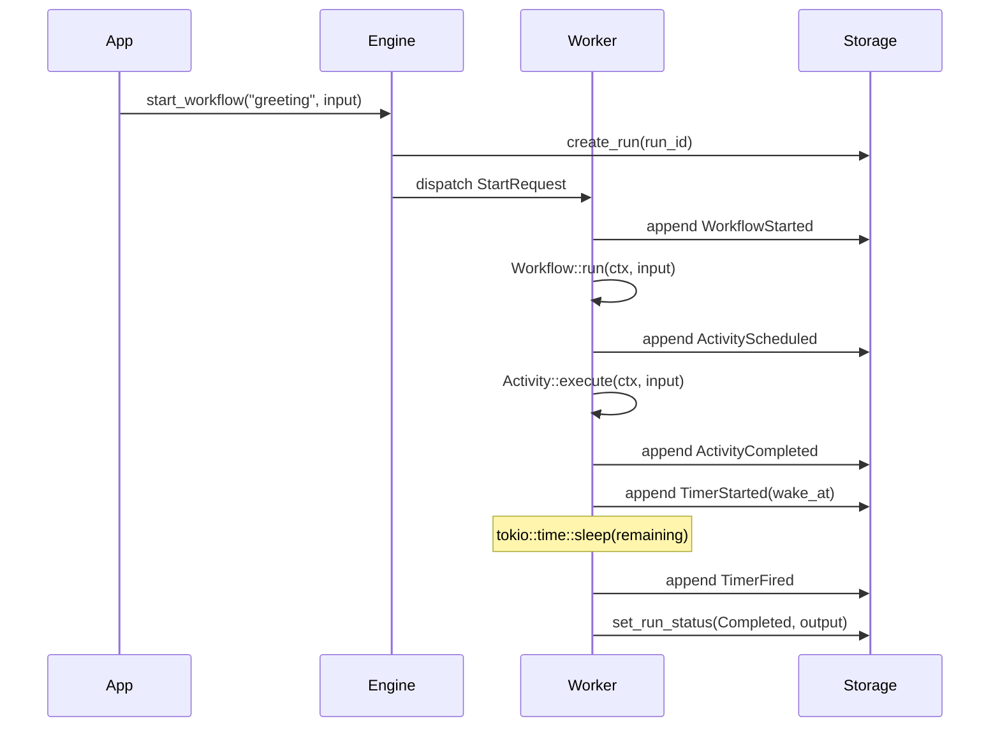
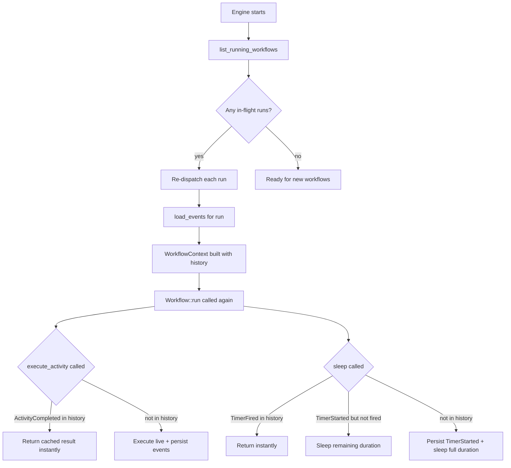
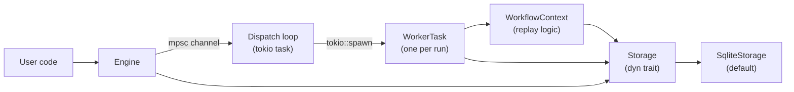

# ZDFlow

A durable workflow execution engine written in Rust, inspired by [Temporal.io](https://temporal.io). zdflow lets you write long-running, stateful business processes as ordinary async Rust functions — crash the process mid-execution, restart it, and the workflow resumes exactly where it left off.

## How it works

ZDFlow persists every state transition to an append-only event log (SQLite). When a workflow is re-executed after a crash, the engine **replays** those events to fast-forward to the point where execution stopped, then continues from there.



On crash-recovery, the engine calls `list_running_workflows()` at startup and re-dispatches those runs. The `WorkflowContext` loads the saved event history and skips already-completed steps:



## Core concepts

### Workflow

A `Workflow` is a deterministic async function. It must not perform I/O directly — all side effects go through `ctx.execute_activity()` or `ctx.sleep()`. The engine may re-execute the function multiple times during replay; the function must produce the same sequence of calls each time.

```rust
struct MyWorkflow;

impl Workflow for MyWorkflow {
    fn name(&self) -> &'static str { "my_workflow" }

    fn run(&self, ctx: WorkflowContext, input: Value) -> WorkflowFuture {
        Box::pin(async move {
            let result = ctx.execute_activity(&MyActivity, input).await?;
            ctx.sleep(Duration::from_secs(60)).await?;
            Ok(result)
        })
    }
}
```

### Activity

An `Activity` performs the actual I/O — HTTP calls, database writes, sending emails. Activities are retried automatically on failure with exponential backoff.

```rust
struct MyActivity;

impl Activity for MyActivity {
    fn name(&self) -> &'static str { "my_activity" }

    fn execute(&self, ctx: ActivityContext, input: Value) -> ActivityFuture {
        Box::pin(async move {
            // Any I/O is safe here
            Ok(json!({ "done": true }))
        })
    }

    fn max_attempts(&self) -> u32 { 5 }
    fn retry_base_delay(&self) -> Duration { Duration::from_secs(2) }
}
```

Retry timing: delay before attempt `n` = `base_delay × 2^(n-1)`.

### Durable timers

`ctx.sleep(duration)` and `ctx.sleep_until(datetime)` are crash-safe. The absolute wake time is stored in the event log when the timer is first created. After a crash, only the **remaining** duration is slept — not the full original duration.

## Event log

Every state transition appends an immutable event. The full schema:

| Event | When written |
|---|---|
| `WorkflowStarted` | Once, when a new run begins |
| `ActivityScheduled` | Before each activity execution |
| `ActivityCompleted` | Activity returned `Ok` |
| `ActivityAttemptFailed` | One attempt failed; retries remain |
| `ActivityErrored` | All retries exhausted |
| `TimerStarted` | When `ctx.sleep*` is first called |
| `TimerFired` | After the sleep elapses |
| `WorkflowCompleted` | Workflow returned `Ok` |
| `WorkflowFailed` | Workflow returned `Err` |

Each event carries a monotonic `sequence` (global position in the run's log) and a `sequence_id` (logical call index, shared between activities and timers, used as the replay key).

## Getting started

```bash
# Run the demo HTTP server
cargo run

# In another terminal
curl -X POST http://localhost:3000/greet \
     -H 'Content-Type: application/json' \
     -d '{"name": "Alice"}'
# Returns: {"run_id": "<uuid>"}
```

The demo runs a `GreetingWorkflow` that executes an activity, sleeps 2 seconds, then executes the activity again. Kill the process during the sleep, restart it, and the workflow resumes with only the remaining time left.

## Engine setup

```rust
let storage = SqliteStorage::open("my-app.db").await?;

let mut engine = WorkflowEngine::builder()
    .with_storage(storage)
    .register_workflow(MyWorkflow)
    .register_activity(MyActivity)
    .max_concurrent_workflows(100)  // default: 100
    .build()
    .await?;

let handle = engine.run().await?;   // starts dispatch loop + crash recovery
let engine = Arc::new(engine);

// Start a workflow
let run_id = engine.start_workflow("my_workflow", json!({"key": "value"})).await?;

// Poll status
let status = engine.get_run_status(run_id).await?;

// Graceful shutdown
handle.shutdown().await;
```

## Custom storage

Implement the `Storage` trait to use a different persistence backend:

```rust
pub trait Storage: Send + Sync + 'static {
    fn create_run(&self, run_id: Uuid, workflow_name: &str, input: &Value) -> StorageFuture<()>;
    fn append_event(&self, run_id: Uuid, event: &WorkflowEvent) -> StorageFuture<()>;
    fn load_events(&self, run_id: Uuid) -> StorageFuture<Vec<WorkflowEvent>>;
    fn list_running_workflows(&self) -> StorageFuture<Vec<RunRecord>>;
    fn set_run_status(&self, run_id: Uuid, status: RunStatus, result: Option<Value>) -> StorageFuture<()>;
    fn get_run_status(&self, run_id: Uuid) -> StorageFuture<RunStatus>;
}
```

## Building and testing

```bash
cargo build
cargo test
cargo test storage::sqlite  # run a specific test module
cargo clippy
cargo fmt
```

Tests use an in-memory SQLite database (`SqliteStorage::open(":memory:")`), so no files are created.

## Architecture overview

```
src/
├── lib.rs          Public API surface and re-exports
├── main.rs         Demo application (Axum HTTP server)
├── traits.rs       Workflow, Activity, Storage trait definitions
├── event.rs        WorkflowEvent and EventPayload types
├── context.rs      WorkflowContext (replay engine) and ActivityContext
├── engine.rs       WorkflowEngineBuilder, WorkflowEngine, dispatch loop
├── worker.rs       WorkerTask — executes one workflow run end-to-end
└── storage/
    └── sqlite.rs   SQLiteStorage implementation (WAL mode, bundled SQLite)
```



The dispatch loop holds a `Semaphore` to bound concurrent workflow executions. Each `WorkerTask` holds a permit; dropping it when the workflow completes frees the slot.

## Current capabilities

- **Durable activity execution** — results cached in event log; re-executed from cache on replay
- **Automatic retries with exponential backoff** — configurable `max_attempts` and `retry_base_delay` per activity
- **Durable timers** — `ctx.sleep(duration)` and `ctx.sleep_until(datetime)` survive process crashes
- **Crash recovery** — in-flight workflows detected and resumed on engine startup
- **Pluggable storage** — `Storage` trait; SQLite provided out of the box (WAL mode, bundled)
- **Concurrency limit** — semaphore-based cap on simultaneous workflow executions
- **Graceful shutdown** — `EngineHandle::shutdown()` stops the dispatch loop
- **Structured logging** — `tracing` integration with `RUST_LOG` env filter
- **Run status polling** — `engine.get_run_status(run_id)`

## Limitations and known gaps

### No workflow-to-workflow communication
There is no `ctx.start_child_workflow()` or `ctx.signal_workflow()`. Parent/child relationships, signals, and queries are not implemented.

### No `WorkflowCompleted` / `WorkflowFailed` events written to the log
`worker.rs` calls `set_run_status()` to mark a run as complete/failed, but it does not append a `WorkflowCompleted` or `WorkflowFailed` event to the event log. Those `EventPayload` variants exist in the type system but are never written. This means the event log alone is insufficient to determine final outcome; you must also query `workflow_runs`.

### Activity registry is unused during execution
Activities are registered on the engine builder and stored in a `HashMap`, but the dispatch loop passes the registry to `WorkflowContextWithRegistry` which ignores it (`_activities`). Workflow code must construct activity instances directly and pass them to `ctx.execute_activity()`. The registry only prevents "unknown workflow" errors at dispatch time for workflows.

### Single SQLite connection
`SqliteStorage` wraps a single `tokio-rusqlite` connection. In write-heavy scenarios this serializes all storage operations. A connection pool (e.g. `deadpool-sqlite`) would improve throughput.

### No backpressure when dispatch channel is full
`start_workflow` sends to a bounded `mpsc::channel(1024)`. If 1024 starts are in flight and the dispatch loop is fully occupied, `start_workflow` will block or return an error. There is no built-in queue or persistence for the pending starts.

### Replay re-executes the full workflow function from the top
On recovery, the workflow function runs from the beginning, fast-forwarding through history by returning cached results. For very long workflows with large histories, this replay can be slow. Snapshot/checkpoint support (saving the workflow's intermediate state) would mitigate this.

### No timeout support for activities
There is no per-activity execution deadline. A hung activity blocks its worker task indefinitely. Activity-level timeouts need to be implemented manually (e.g., wrapping the call with `tokio::time::timeout`).

### No versioning / migration support
If you change workflow logic (add/remove an `execute_activity` call), old in-flight runs will misalign their call counters against history, causing incorrect replay. There is no `ctx.get_version()` mechanism (as Temporal has) to safely branch on code versions.

### No workflow search or listing
There is no API to list all runs, filter by status, or search by workflow name. The storage trait exposes only `list_running_workflows()` (used internally for recovery).

### No distributed execution
All workers run in a single process. There is no worker-pool protocol, task queue, or distributed coordination layer. Scaling out requires building those on top.

## Future improvements

- **Child workflows** — `ctx.start_child_workflow()` with parent/child linking and cancellation propagation
- **Signals and queries** — external events that can be sent into a running workflow; read-only queries against workflow state
- **Versioning** — `ctx.get_version(change_id, min, max)` to allow safe code changes without breaking in-flight runs
- **Activity timeouts** — per-activity deadline, distinct from retry exhaustion
- **Heartbeating** — long-running activities report liveness; engine can detect and restart stalled ones
- **Connection pool** — replace the single SQLite connection with a pool for higher write throughput
- **Alternative storage backends** — PostgreSQL, Redis, or a distributed key-value store
- **Run listing and search** — `engine.list_runs(filter)` for observability and ops tooling
- **Workflow cancellation** — `engine.cancel_workflow(run_id)` that cooperatively terminates a running workflow
- **Scheduled workflows** — `engine.schedule_workflow(name, input, cron_expr)` for periodic execution
- **Metrics and observability** — expose Prometheus counters/histograms for queue depth, run durations, retry rates
- **Determinism checker** — a test-mode that re-executes workflows twice and panics on divergence, to catch non-determinism bugs early
- **Snapshots / checkpoints** — persist intermediate workflow state to bound replay time for long-running workflows
