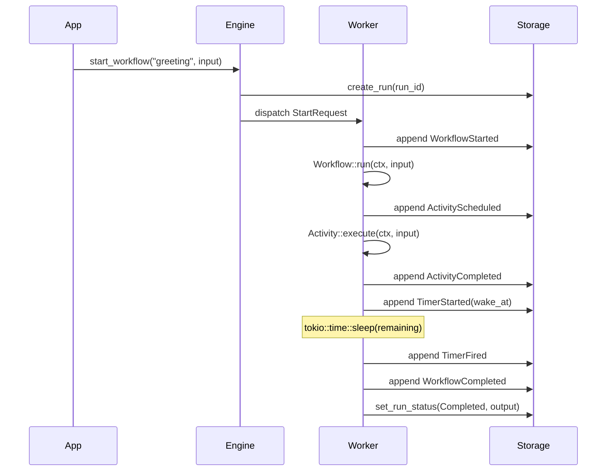
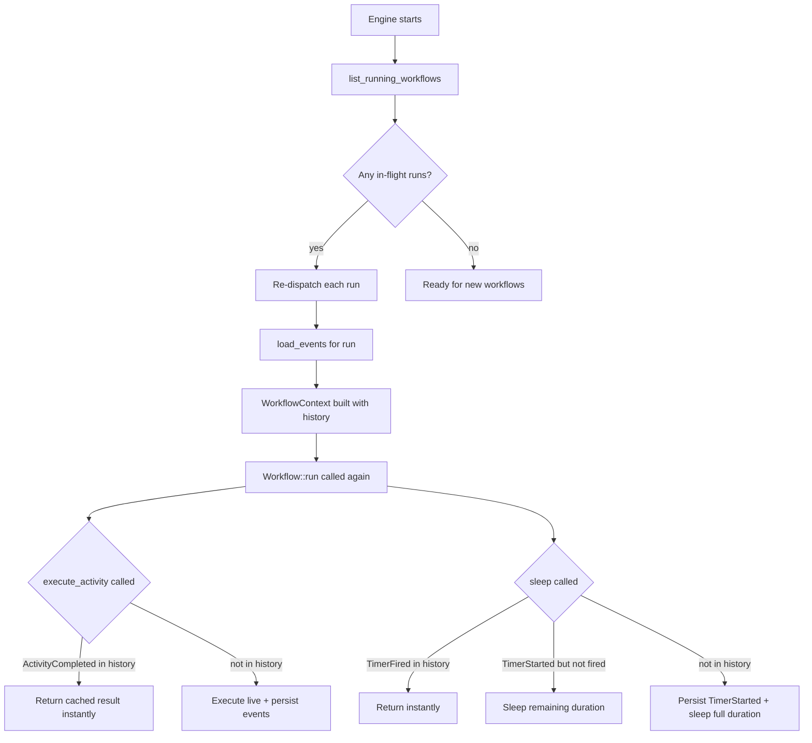
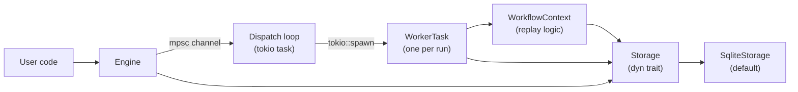

# ZDFlow

A durable workflow execution engine written in Rust, inspired by [Temporal.io](https://temporal.io). zdflow lets you write long-running, stateful business processes as ordinary async Rust functions — crash the process mid-execution, restart it, and the workflow resumes exactly where it left off.

## How it works

ZDFlow persists every state transition to an append-only event log (SQLite). When a workflow is re-executed after a crash, the engine **replays** those events to fast-forward to the point where execution stopped, then continues from there.



On crash-recovery, the engine calls `list_running_workflows()` at startup and re-dispatches those runs. The `WorkflowContext` loads the saved event history and skips already-completed steps:



## Core concepts

### Workflow

A `Workflow` is a deterministic async function. It must not perform I/O directly — all side effects go through `ctx.execute_activity()` or `ctx.sleep()`. The engine may re-execute the function multiple times during replay; the function must produce the same sequence of calls each time.

```rust
struct MyWorkflow;

impl Workflow for MyWorkflow {
    fn name(&self) -> &'static str { "my_workflow" }

    fn run(&self, ctx: WorkflowContext, input: Value) -> WorkflowFuture {
        Box::pin(async move {
            let result = ctx.execute_activity("my_activity", input).await?;
            ctx.sleep(Duration::from_secs(60)).await?;
            Ok(result)
        })
    }
}
```

### Activity

An `Activity` performs the actual I/O — HTTP calls, database writes, sending emails. Activities are retried automatically on failure with exponential backoff. Activities are referenced by name (the string returned by `Activity::name()`), not by passing an instance.

```rust
struct MyActivity;

impl Activity for MyActivity {
    fn name(&self) -> &'static str { "my_activity" }

    fn execute(&self, ctx: ActivityContext, input: Value) -> ActivityFuture {
        Box::pin(async move {
            // Any I/O is safe here
            Ok(json!({ "done": true }))
        })
    }

    fn max_attempts(&self) -> u32 { 5 }
    fn retry_base_delay(&self) -> Duration { Duration::from_secs(2) }
    fn timeout(&self) -> Option<Duration> { Some(Duration::from_secs(30)) }
}
```

Retry timing: delay before attempt `n` = `base_delay × 2^(n-1)`.

### Activity timeouts

Activities can define an optional `timeout()`. If an activity does not complete within the timeout duration, the attempt is treated as a failure and may be retried (up to `max_attempts`). Each timed-out attempt persists an `ActivityAttemptTimedOut` event.

```rust
fn timeout(&self) -> Option<Duration> {
    Some(Duration::from_secs(30))  // 30s per attempt
}
```

### Durable timers

`ctx.sleep(duration)` and `ctx.sleep_until(datetime)` are crash-safe. The absolute wake time is stored in the event log when the timer is first created. After a crash, only the **remaining** duration is slept — not the full original duration.

### Parallel activities

`ctx.execute_activities_parallel()` executes multiple activities concurrently while preserving deterministic replay. Sequence IDs are pre-allocated for all branches, so replay correctness is maintained.

```rust
let results = ctx.execute_activities_parallel(vec![
    ("fetch_user", json!({"id": 1})),
    ("fetch_user", json!({"id": 2})),
    ("fetch_orders", json!({"user_id": 1})),
]).await?;
// results[0], results[1], results[2] correspond to the inputs in order
```

If any activity fails, remaining in-flight activities are cancelled and the first error is returned.

### Versioning

`ctx.get_version()` enables safe workflow code changes while runs are in-flight. On a fresh execution, `max_version` is stored and returned. On replay, the previously stored version is returned. This lets you branch on code versions without breaking in-progress runs.

```rust
fn run(&self, ctx: WorkflowContext, input: Value) -> WorkflowFuture {
    Box::pin(async move {
        let version = ctx.get_version("add_notification", 1, 2).await?;

        let result = ctx.execute_activity("process_order", input).await?;

        if version >= 2 {
            // New code path — only runs for new executions.
            ctx.execute_activity("send_notification", result.clone()).await?;
        }

        Ok(result)
    })
}
```

Unlike `execute_activity` and `sleep`, version markers are keyed by `change_id` (not by sequence position), so inserting a `get_version` call does not shift other calls' sequence IDs.

### Workflow cancellation

Running workflows can be cancelled via `engine.cancel_workflow(run_id)`. At the next yield point (`execute_activity` or `sleep`), the context returns `ZdflowError::Cancelled`, a `WorkflowCancelled` event is written, and the run status is set to `Cancelled`.

```rust
engine.cancel_workflow(run_id).await?;
```

Workflows can also check `ctx.is_cancelled()` for cooperative cancellation within long-running logic.

### Run listing and search

`engine.list_runs()` returns workflow runs matching a filter:

```rust
let completed = engine.list_runs(&RunFilter {
    status: Some(RunStatus::Completed),
    workflow_name: Some("my_workflow".into()),
    limit: Some(10),
    ..Default::default()
}).await?;

for run in &completed {
    println!("{} — {:?} — {}", run.run_id, run.status, run.workflow_name);
}
```

`RunFilter` supports: `status`, `workflow_name`, `created_after`, `created_before`, `limit`, `offset`.

## Event log

Every state transition appends an immutable event. The full schema:

| Event | When written |
|---|---|
| `WorkflowStarted` | Once, when a new run begins |
| `ActivityScheduled` | Before each activity execution |
| `ActivityCompleted` | Activity returned `Ok` |
| `ActivityAttemptFailed` | One attempt failed; retries remain |
| `ActivityAttemptTimedOut` | One attempt timed out; retries remain |
| `ActivityErrored` | All retries exhausted |
| `TimerStarted` | When `ctx.sleep*` is first called |
| `TimerFired` | After the sleep elapses |
| `VersionMarker` | When `ctx.get_version()` records a version |
| `WorkflowCompleted` | Workflow returned `Ok` |
| `WorkflowFailed` | Workflow returned `Err` |
| `WorkflowCancelled` | Workflow was cancelled |

Each event carries a monotonic `sequence` (global position in the run's log) and a `sequence_id` (logical call index, shared between activities and timers, used as the replay key).

## Getting started

```bash
# Run the demo HTTP server
cargo run

# In another terminal
curl -X POST http://localhost:3000/greet \
     -H 'Content-Type: application/json' \
     -d '{"name": "Alice"}'
# Returns: {"run_id": "<uuid>"}
```

The demo runs a `GreetingWorkflow` that executes an activity, sleeps 2 seconds, then executes the activity again. Kill the process during the sleep, restart it, and the workflow resumes with only the remaining time left.

## Engine setup

```rust
let storage = SqliteStorage::open("my-app.db").await?;

let mut engine = WorkflowEngine::builder()
    .with_storage(storage)
    .register_workflow(MyWorkflow)
    .register_activity(MyActivity)
    .max_concurrent_workflows(100)  // default: 100
    .build()
    .await?;

let handle = engine.run().await?;   // starts dispatch loop + crash recovery
let engine = Arc::new(engine);

// Start a workflow
let run_id = engine.start_workflow("my_workflow", json!({"key": "value"})).await?;

// Poll status
let status = engine.get_run_status(run_id).await?;

// List runs
let runs = engine.list_runs(&RunFilter::default()).await?;

// Cancel a workflow
engine.cancel_workflow(run_id).await?;

// Graceful shutdown
handle.shutdown().await;
```

## Metrics

zdflow optionally records metrics via the [`metrics`](https://docs.rs/metrics) facade. Enable the `metrics` Cargo feature and install your own exporter (e.g. `metrics-exporter-prometheus`).

```toml
[dependencies]
zdflow = { version = "0.1", features = ["metrics"] }
metrics-exporter-prometheus = "0.16"
```

Emitted metrics:

| Metric | Type | Description |
|---|---|---|
| `zdflow_workflow_started_total` | counter | Workflows started (label: `workflow`) |
| `zdflow_workflow_completed_total` | counter | Workflows completed successfully |
| `zdflow_workflow_failed_total` | counter | Workflows that failed |
| `zdflow_workflow_cancelled_total` | counter | Workflows cancelled |
| `zdflow_workflow_active` | gauge | Currently in-progress workflows |
| `zdflow_activity_started_total` | counter | Activity executions started (label: `activity`) |
| `zdflow_activity_completed_total` | counter | Activity executions completed |
| `zdflow_activity_retries_total` | counter | Activity retry attempts |
| `zdflow_activity_duration_seconds` | histogram | Activity execution duration |

## Custom storage

Implement the `Storage` trait to use a different persistence backend:

```rust
pub trait Storage: Send + Sync + 'static {
    fn create_run(&self, run_id: Uuid, workflow_name: &str, input: &Value) -> StorageFuture<()>;
    fn append_event(&self, run_id: Uuid, event: &WorkflowEvent) -> StorageFuture<()>;
    fn load_events(&self, run_id: Uuid) -> StorageFuture<Vec<WorkflowEvent>>;
    fn list_running_workflows(&self) -> StorageFuture<Vec<RunRecord>>;
    fn set_run_status(&self, run_id: Uuid, status: RunStatus, result: Option<Value>) -> StorageFuture<()>;
    fn get_run_status(&self, run_id: Uuid) -> StorageFuture<RunStatus>;
    fn list_runs(&self, filter: &RunFilter) -> StorageFuture<Vec<RunInfo>>;
}
```

## Building and testing

```bash
cargo build
cargo test
cargo test storage::sqlite  # run a specific test module
cargo clippy
cargo fmt
```

Tests use an in-memory SQLite database (`SqliteStorage::open(":memory:")`), so no files are created.

## Architecture overview

```
src/
├── lib.rs          Public API surface and re-exports
├── main.rs         Demo application (Axum HTTP server)
├── traits.rs       Workflow, Activity, Storage trait definitions
├── event.rs        WorkflowEvent and EventPayload types
├── context.rs      WorkflowContext (replay engine) and ActivityContext
├── engine.rs       WorkflowEngineBuilder, WorkflowEngine, dispatch loop
├── worker.rs       WorkerTask — executes one workflow run end-to-end
├── metrics.rs      Optional metrics instrumentation (behind `metrics` feature)
└── storage/
    └── sqlite.rs   SQLiteStorage implementation (WAL mode, bundled SQLite)
```



The dispatch loop holds a `Semaphore` to bound concurrent workflow executions. Each `WorkerTask` holds a permit; dropping it when the workflow completes frees the slot.

## Current capabilities

- **Durable activity execution** — results cached in event log; re-executed from cache on replay
- **Activity registry** — activities are registered by name and looked up from the context; no manual construction needed
- **Automatic retries with exponential backoff** — configurable `max_attempts` and `retry_base_delay` per activity
- **Activity timeouts** — optional per-activity execution deadline via `Activity::timeout()`
- **Parallel activities** — `ctx.execute_activities_parallel()` for concurrent fan-out with deterministic replay
- **Durable timers** — `ctx.sleep(duration)` and `ctx.sleep_until(datetime)` survive process crashes
- **Versioning** — `ctx.get_version(change_id, min, max)` for safe workflow code changes with in-flight runs
- **Crash recovery** — in-flight workflows detected and resumed on engine startup
- **Workflow cancellation** — `engine.cancel_workflow(run_id)` cooperatively stops a running workflow
- **Run listing and search** — `engine.list_runs(filter)` with status, name, date range, and pagination
- **Pluggable storage** — `Storage` trait; SQLite provided out of the box (WAL mode, bundled)
- **Concurrency limit** — semaphore-based cap on simultaneous workflow executions
- **Graceful shutdown** — `EngineHandle::shutdown()` stops the dispatch loop
- **Structured logging** — `tracing` integration with `RUST_LOG` env filter
- **Run status polling** — `engine.get_run_status(run_id)`
- **Metrics** — optional Prometheus-compatible counters/gauges/histograms via `metrics` crate (feature-gated)

## Limitations and known gaps

### No workflow-to-workflow communication
There is no `ctx.start_child_workflow()` or `ctx.signal_workflow()`. Parent/child relationships, signals, and queries are not implemented.

### Single SQLite connection
`SqliteStorage` wraps a single `tokio-rusqlite` connection. In write-heavy scenarios this serializes all storage operations. A connection pool (e.g. `deadpool-sqlite`) would improve throughput.

### No backpressure when dispatch channel is full
`start_workflow` sends to a bounded `mpsc::channel(1024)`. If 1024 starts are in flight and the dispatch loop is fully occupied, `start_workflow` will block or return an error. There is no built-in queue or persistence for the pending starts.

### Replay re-executes the full workflow function from the top
On recovery, the workflow function runs from the beginning, fast-forwarding through history by returning cached results. For very long workflows with large histories, this replay can be slow. Snapshot/checkpoint support (saving the workflow's intermediate state) would mitigate this.

### No distributed execution
All workers run in a single process. There is no worker-pool protocol, task queue, or distributed coordination layer. Scaling out requires building those on top.

## Future improvements

- **Child workflows** — `ctx.start_child_workflow()` with parent/child linking and cancellation propagation
- **Signals and queries** — external events that can be sent into a running workflow; read-only queries against workflow state
- **Heartbeating** — long-running activities report liveness; engine can detect and restart stalled ones
- **Connection pool** — replace the single SQLite connection with a pool for higher write throughput
- **Alternative storage backends** — PostgreSQL, Redis, or a distributed key-value store
- **Scheduled workflows** — `engine.schedule_workflow(name, input, cron_expr)` for periodic execution
- **Determinism checker** — a test-mode that re-executes workflows twice and panics on divergence, to catch non-determinism bugs early
- **Snapshots / checkpoints** — persist intermediate workflow state to bound replay time for long-running workflows
